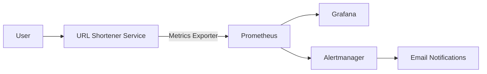
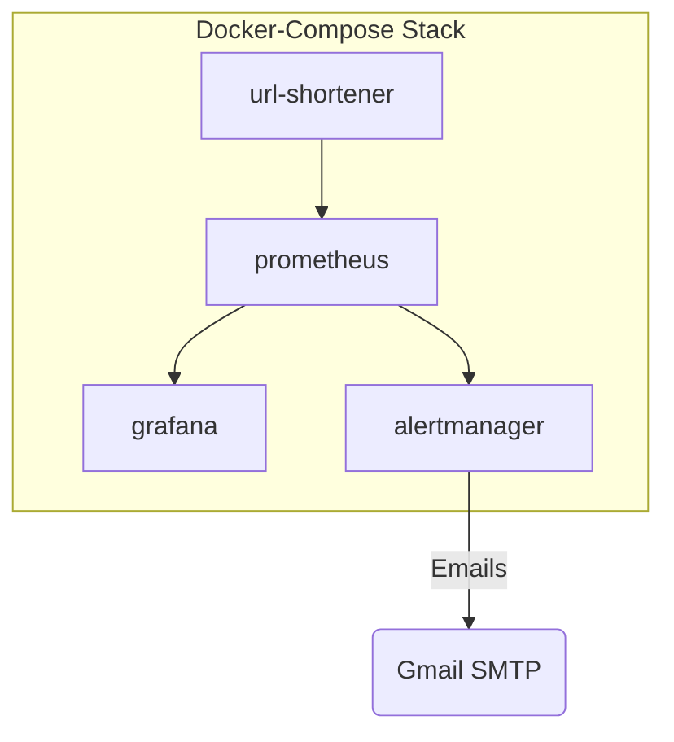

# URL Shortener with Monitoring & Alerting (Prometheus + Grafana + Alertmanager + Gmail)

This project is a fully containerized **URL Shortener microservice**
with complete **monitoring, alerting, and dashboards** using:

-   **Prometheus** -- metrics scraping\
-   **Grafana** -- dashboards\
-   **Alertmanager** -- sends email notifications\
-   **Gmail SMTP** -- sends real-time alerts\
-   **Docker Compose** -- orchestrates all services

## Project Overview

The core of the project is a lightweight **URL Shortener** API that:

-   Accepts long URLs\
-   Generates short identifiers\
-   Stores mappings in a local SQLite DB\
-   Tracks operational metrics

To make the service production-ready, the project includes full
observability and alerting.

## Project Structure

    project/
    │
    ├── docker-compose.yml
    │
    ├── url-shortener/
    │   ├── app.py
    │   ├── requirements.txt
    │   ├── Dockerfile
    │   └── data/
    │
    ├── prometheus.yml
    │
    ├── alertmanager/
    │   └── alertmanager.yml
    │
    └── grafana/
        ├── dashboards/
        └── provisioning/

## Running the Project

### 1. Clone the repository

    git clone <your-repo>
    cd project

### 2. Start using Docker Compose

    docker compose up -d --build

### 3. Access the services

  Service         URL
  --------------- -----------------------
  URL Shortener   http://localhost:5000
  Prometheus      http://localhost:9090
  Alertmanager    http://localhost:9093
  Grafana         http://localhost:3000

Default Grafana login:

    user: admin
    pass: admin

## Alerting Pipeline

1.  Prometheus detects a failing service\
2.  Prometheus fires an alert\
3.  Alertmanager receives it\
4.  Alertmanager sends an email using Gmail SMTP\
5.  You receive the alert in your inbox

## Testing Alerts

To trigger an alert:

    docker stop url-shortener

To restore:

    docker start url-shortener

## API Endpoints

### Create Short URL

**POST /shorten**

Body:

    {
      "url": "https://example.com"
    }

Response:

    {
      "short_url": "http://localhost:5000/abcd"
    }

### Redirect

**GET /`<short_id>`{=html}**

Redirects to the original URL.

### Metrics

**GET /metrics**

Exposes Prometheus metrics.

## Stopping Services

    docker compose down

To remove all data:

    docker compose down -v

## 🖼 Architecture Diagram (Mermaid)

## 🗄 Container Architecture

